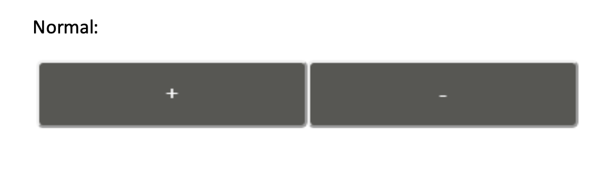

# FizzBuzz Counter

An counter app with an authenticated login page that returns Fizz for multiples of 3, Buzz for multiples of 5 or FizzBuzz for multiples of 3 and 5.
Completed as part of an assessment.

## Prerequisites

- Node
- NPM

## Usage

Ensure you have Node and NPM installed.  
In your terminal type:

- `npm i` to install all required packages
- `npm run start` to concurrently run the server, initiate the database and run the client in development mode

Use the following credentials to login and use the couter.

Preset credentials:

- Username: Kenzie
- Password: Cat12345

## Testing

In your terminal type:

- `npm run test` to run all tests

## Project Requirements:

Challenge:

"Write a program that outputs a counter that can be incremented or decremented. But for multiples
of three print “Fizz” instead of the number and for the multiples of five print “Buzz”. For numbers
which are multiples of both three and five print “FizzBuzz”."

- [x] Node.js web application:
  - [x] Can be built using webpack or any other build tools as desired
  - [x] Is supported and setup to use a testing framework
- [x] All code committed to GitHub (small progressive commits)
- [x] Logic supported through use of unit tests
- [x] CSS used for styling

- [x] Login page using an authentication API:

  - [x] Upon successful authentication the user is redirected to the landing page
  - [x] Upon failed authentication the user is notified of the failure

- [x] Landing page:

  - [x] Two buttons - increment and decrement
  - [x] Text field
  - [x] Button styling to match example provided below
  - [x] Buttons to be cyan when active
  - [x] Buttons respectively increment and decrement a counter
  - [x] Buttons execute the logic of checking the counter
  - [x] Result of the above logic will be written to the text field
  - [x] Validation to prevent the count from exceeding 100 or below 0
  - [x] User notification of the above validation

## Future State

- Unit tests for authentication and page navigation
- Serve static files for a production build using express.static()
- Deploy using GitHub Pages or Heroku

## Technologies Used:

- Webpack for bundling modules
- Jest for testing
- Sequelize as the ORM
- SQLite3 for the database
- React to build out the front end
- Express-Session for authentication and creating cookies
- Express to create the server
- BCRYPT for password hashing
- CSS modules for local scoping of the styling
